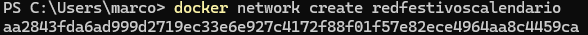
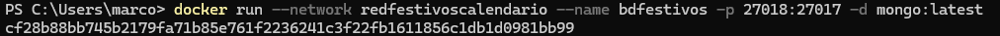
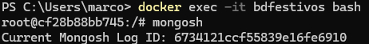
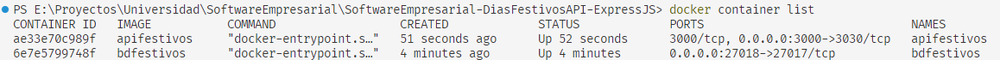
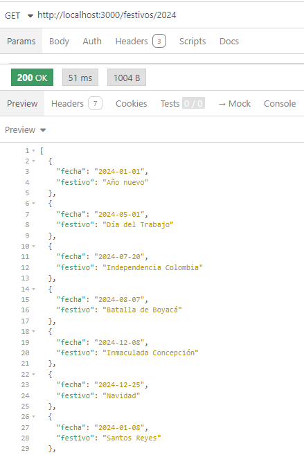
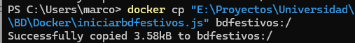
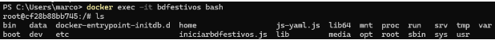
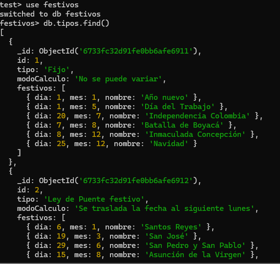

# 💻 Cómo ejecutar.

## ⌨️ Comandos.

### 🔗 Red de contenedores.

Lo primero es que se debe crear una red de datos interna para que los contenedores se puedan comunicar internamente; esto se hace con el comando.

```bash
docker network create <NombreRed>
```

Un ejemplo sería:

```bash
docker network create redfestivoscalendario
```

Y el resultado será un serial o identificador:



### 🪞 Imagenes necesarias.

- **MongoDB**: La base de datos requiere MongoBD, para esto comando:

  ```bash
  docker pull mongo
  ```

  Más información sobre la imagen de mongo se puede consultar en el sitio [oficial de docker](https://hub.docker.com/_/mongo/).

- **Imagen del código**: Para crear la imagen del API se debe crear el archivo [dockerfile](dockerfile) que contendrá las instrucciones para crear la imagen.

  No se entrará en muchos detalles en esta definición ya que en el archivo se encuentran algunos comentarios útiles.
  Y para ejecutar el archivo y crear la imagen se ejecuta el comando:
  ```bash
  docker build . -t <NombreImagen>
  ```
  ```bash
  docker build . -t apifestivos
  ```
  > Por cada cambio que se realice en el código se debe crear una nueva imagen del código.

### 🐳 Creación de contenedores.

- **Base de datos Mongo**:Luego de tener la imagen descargada se debe crear el contenedor de mongo.

  ```bash
  docker run --network <NombreRed> --name <NombreContenedor> -p <PuertoExterno>:<PuertoInterno> -d <imagen>:<Versión>
  ```

  ```bash
  docker run --network redfestivoscalendario --name bdfestivos -p 27018:27017 -d mongo:latest
  ```

  Y el resultado será nuevamente un identificador o serial:

  

  Se puede ingresar al contenedor (útil para realizar pruebas) y revisar si mongo fue corretamente instalado:

  

- **Contenerización del API**: Al igual que para la base de datos se ejecuta el comando `docker run`:

  ```bash
   docker run --network redfestivoscalendario --name apifestivos -p 3000:3030  -d mongo:latest
  ```

### 🚠 Probar el API.

Para verificar si los contenedores están en ejecución se ejecuta el comando

```bash
docker container list
```



El API se puede probar desde la terminal con la función `cURL` o desde interfaces gráficas como Posmtna o Insomnia.

Se debe tener en cuenta el puerto para probar el API, en este caso será el `3000` ya que fue el puerto que se dejó expuesto para consumir desde *fuera* de la red de contenedores.



### 📝 Notas adicionales.

- **Añadir registros a la base de datos**: En la carpeta `BD/Docker/` se encuentra el script para crear y poblar la base de datos de mongo para ejecutar el API.

  Este Script debe ser copiado al contenedor, esto con el comando

  ```bash
  docker cp <UbicacionArchivo> <NombreContenedor>:/
  ```

  ```bash
  docker cp "BD\Docker\iniciarbdfestivos.js" bdfestivos:/
  ```

  En caso de ser exitoso nos lo indicará:

  

  Podemos ingresar nuevamente al contenedor y consultar si quedó registrado:

  

  para usarlo, estando dentro del contenedor se ejecuta el comando.

  ```bash
  mongosh localhost:<puerto> iniciarbdfestivos.js
  ```

  ```bash
  mongosh localhost:27017 iniciarbdfestivos.js
  ```

  Y finalmente desde alguna interfaz o la propia `mongosh` se puede consultar que los registros fueron registrados.

  

- **Concatenar comandos**: En caso de alguna falla o cambios en el código, para no tener que ejecutar los comandos uno a uno se pueden concatenar usando `;`

  ```bash
  docker container stop apifestivos ; docker rm apifestivos ; docker rmi apifestivos ; docker build . -t apifestivos ; docker container run --network redfestivoscalendario --name apifestivos -p 3000:3030 -d apifestivos
  ```

  En este ejemplo se detiene el contenedor `apifestivos`, se elimina el contenedor con el comando `rm`, luego se elimina la imagen con `rmi`, y se repite el proceso de creación de la imagen y el contenedor.